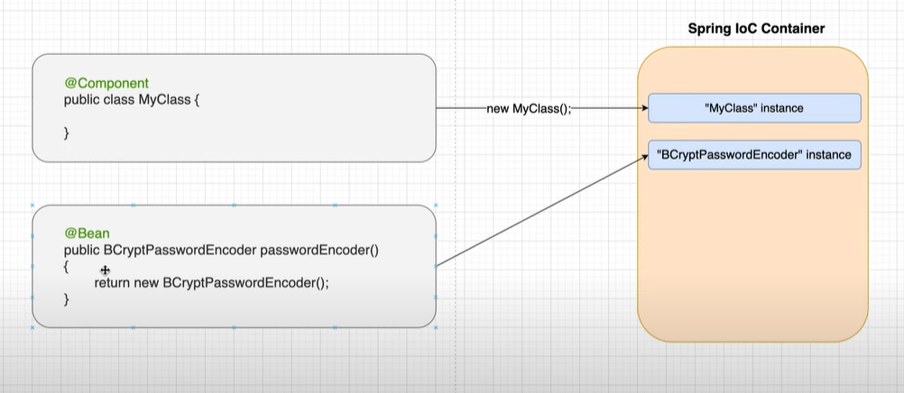
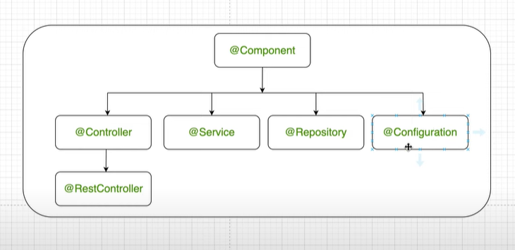

## **@Component Annotation:**

-It is a class level annotation.

-One of Spring's most basic annotations.

-Spring project scans for "Component" annotations when starting

-It creates the object of those classes which are defined in the classes.

## **@Bean Annotation:**

-An annotation used at the method level

-In the methods it is used, an object is created and returned. 

In what situations is it used?

-It can be used for methods that we did not write ourselves.

-Imagine there is a class to make a database connection. Some fields of this class need to be set as username, password, url. In this method, we can create an object by defining set operations. In this way, we can access that object from anywhere.

The picture above shows the annotations inherited from the Component annotation. Therefore, in the classes where those annotations are used, the object is created and added to the IoC Container.