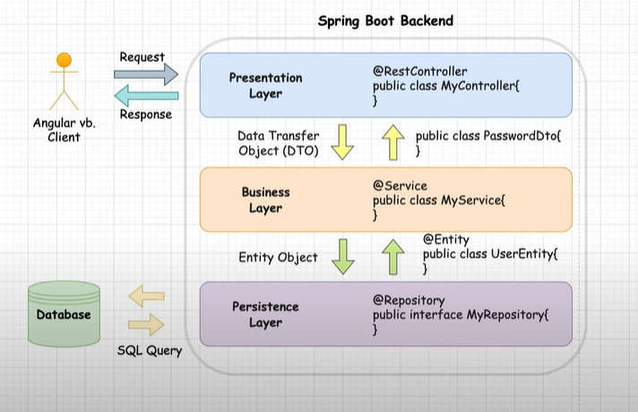
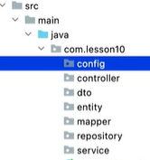

The "layered architecture" structure is used for the development process in Spring Boot projects.

# **LAYERED ARCHITECTURE:**

Classes are grouped. 

Within this structure, each group has its own task.

Each group is called a layer.

## 1.Presentation Layer: 

-It is the layer that talks to the client. 

-The client sends a request and is processed within the project and a response is returned.

-If a rest api is written, the class is marked with the "@RestController" annotation.

## 2.Business Layer:  (Business Logic)

-It is the layer where the codes of the main operations (the actual operations to be done) are written.

For example;

User submitted 2 numbers and wants them added

Request: Sending 2 numbers

Presentation: 2 numbers are taken and transferred to the Service layer

Business: Add 2 numbers and answer returns to Presentation

Presentation: Transmits response to client

-Classes written in the Business Layer are given the "@Service" annotation.

## 3.Persistence Layer: 

-It is the layer where SQL operations take place and communicate with the database.

-Here "interface" is defined. It is marked with the @Repository annotation.

-"SQL Query" is used when communicating.

**config**: The package containing the classes from which the configurations are do

**controller**: The package with the classes written in the Presentation Layer

**dto**: The package containing classes containing data transfer objects

**entity**: The package that will contain the classes corresponding to the tables in the database

**mapper**: The package containing the classes where the dto and entity transformations are do

**repository**: The package that contains the classes of the Persistence Layer with which we communicate with the database

**service**: The package containing the classes that contain the codes of the work done by the main project